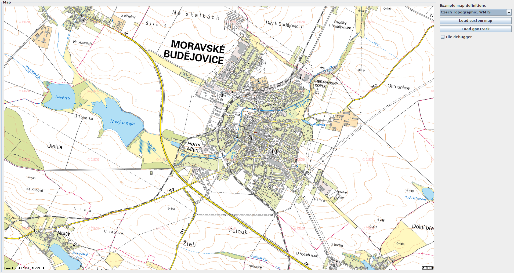
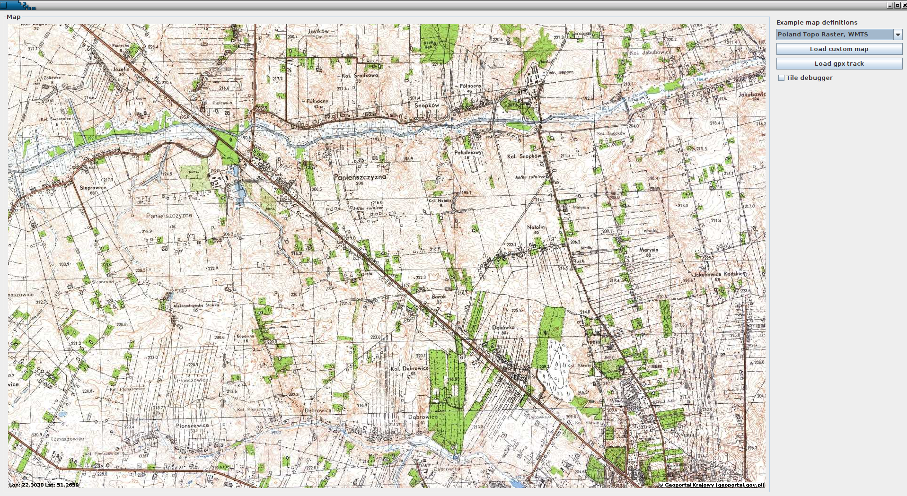
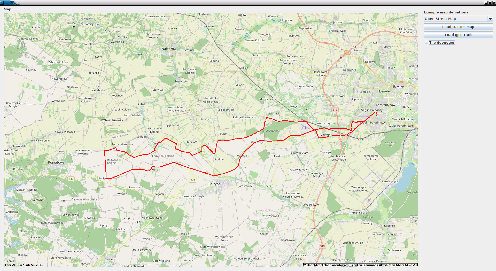
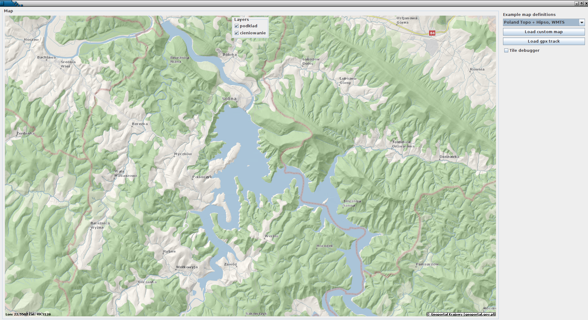
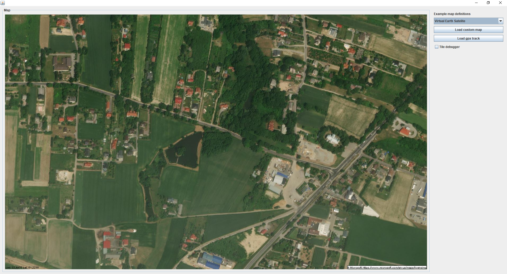

# Java Swing component to display and interact with online maps.

- Supports OpenStreetMap style slippy maps
- Supports WMTS maps
- Supports QUAD tile maps (e.g virtual earth)
- Supports most CRS projections (via proj4j)
- Supports multiple layer maps with transparency/zoom offsets
- Comes with example application and example map definitions.
- Supports user overlays - you can plot anything on the map (waypoints, GPS tracks etc)
- Supports caching (file or in-memory database) of map tiles with configurable timeout
  
# Usage: 

Currently latest deployed to maven central is version 1.3.<br>
For changes always look at ReleaseNotes.txt 


          <dependency>
            <groupId>net.wirelabs</groupId>
            <artifactId>jmaps-viewer</artifactId>
            <version>1.3</version>
          </dependency>
# !!! Warning !!!
Version 1.3 introduced a tiny error, that makes using map sources that have space in query params unusable.<br>
Details are in [Issue #49.](https://github.com/mikey75/jmaps/issues/49) Fix is already commited, but will be available with next maven release. Until then do 
not use map sources with spaces or other not url parsable chars in the query params. This regards mostly some WMTS maps.
# Samples:
jMaps comes with sample demo application. 
It is also an example of using the jMaps component in your own application.<br>
Here's a few pictures telling thousand words ;)
- WMTS Map of Czech Republic

- Poland raster topographic WMTS map

- OpenStreetMap with loaded GPX track

- Example of multilayer map (2 layers - one is a base topo map, the other is elevation profile). 
You can enable/disable given layer from the view.

- Virtual Earth Maps (example of quad tiles) 


# Running example app locally
Your JAVA_HOME should point to java 17:
```
cd jmaps-viewer && mvn clean install && cd ..
cd jmaps-example && mvn clean package && cd ..
cd jmaps-example && java -jar target/jmaps-example.jar
